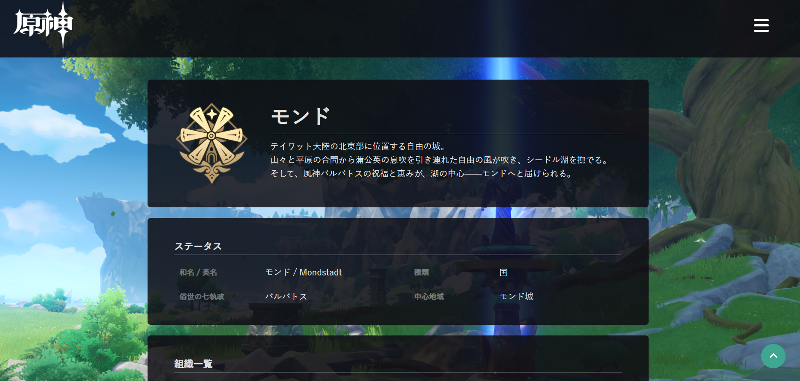
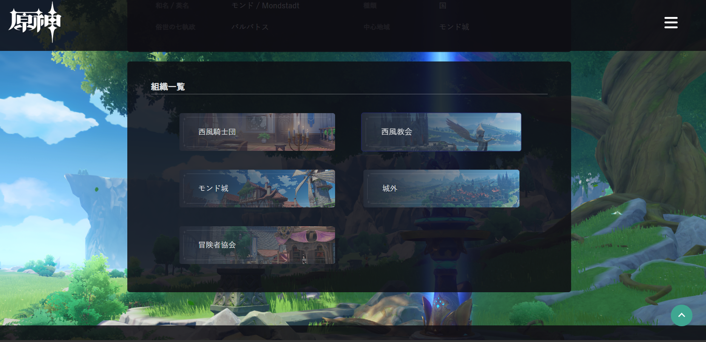
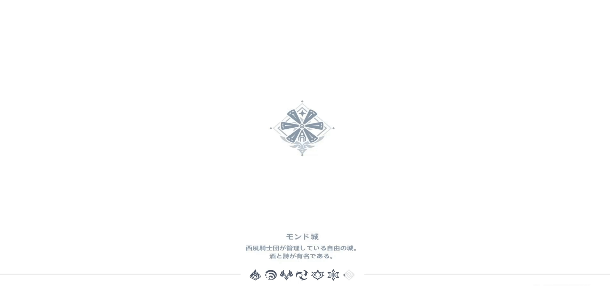
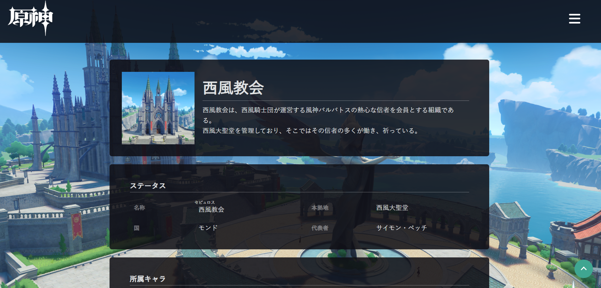
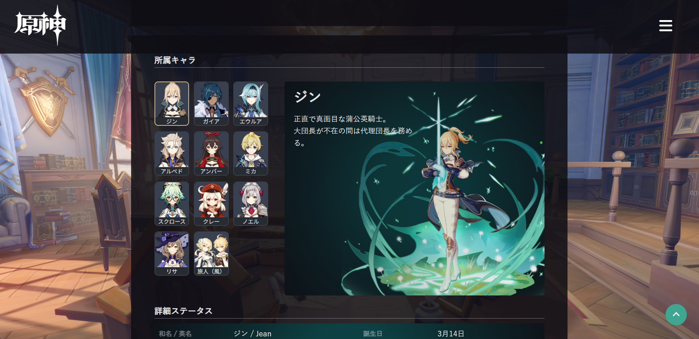

# モンド組織Wiki
１年次の進級制作課題として制作した、ゲーム「原神」の組織を紹介するWebサイトです。

## スクリーンショット

## 使用技術
- HTML
- CSS
- JavaScript

## 制作時期
１年次

## 担当
個人制作課題のため、デザイン・コーディングをすべて担当しました。

## 工夫した点
- 公式Wikiでは組織に関する情報が少ないため、テーマを「組織紹介」に絞って制作しました。
- JavaScriptを使用し、キャラクター情報を切り替えて表示する機能を実装しました。

- 背景画像はすべてゲーム内で撮影したスクリーンショットを使用しました。
- ローディング画面はゲーム内のローディングをGIF化し、読み込みを再現しました。
- マウスカーソルは公式wikiやPC版「原神」と同じものを使用し、世界観を意識しました。

## 今後ブラッシュアップしたい点
- レイアウトが崩れている箇所があるため、CSSを見直したい。
- ローディング画面が全画面表示にしないと少し歪んでいるため、改善したい。
- 検索機能を実装し、情報に素早くアクセスできるようにしたい。
- 組織の詳細情報を増やし、よりWikiに近づけたい。
- 「モンド」というひとつの国しか作れていないため、他の地域も実装したい。

## GitHub Pages
https://plus-wisteria.github.io/Mondstadt-wiki/
